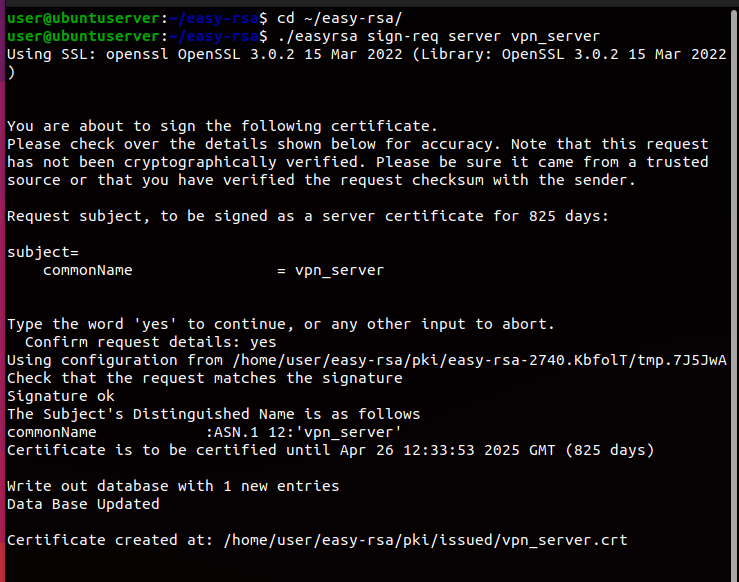

<h1>Servidor OpenVPN utilizando TLS Crypt v2</h1> 

O objetivo desta passo a passo é explicar minuciosamente como é feita uma VPN e também, explicar os termos e tecnologias que serão usadas. Rodando OpenVPN em um Ubuntu Server vamos utilizar o TLS Crypt v2, que vai disponibilizar uma chave tls-crypt para cada usuário, a principal intenção do uso do TLS Crypt é reduzir os danos caso a chave tls-crypt seja comprometida.

<h2>Instalando o OpenVPN e suas dependências</h2>
<h3>OpenVPN</h3>
Primeiro vamos atualizar os pacotes e no mesmo comando vamos instalar o OpenVPN.

<code>sudo apt-get update && sudo apt-get install openvpn </code>

É necessário verificar se foi instalado a versão OpenVPN 
2.5.5, pois o TLS Crypt v2 funcionara apenas a partir desta versão. Caso não tenho instalado esta versão será necessário atualizar o mesmo.

Para verificar a versão:

<code>openvpn --version</code>

<h3>easy-rsa</h3>
Uma dependência importante que precisamos é o easy-rsa, e em uma breve explicação o easy-rsa é um utilitário CLI para construir e gerenciar uma PKI CA. Em termos leigos, isso significa criar uma autoridade de certificação raiz e solicitar e assinar certificados, incluindo CAs intermediárias e listas de certificados revogados (CRL).
Sendo assim, primeira etapa ao configurar o OpenVPN é criar uma Public Key Infrastructure (PKI). Isso consiste em:

<ol>

- Um certificado mestre público de autoridade de certificação (CA) e uma chave privada.

- Um certificado público separado e um par de chaves privadas para cada servidor.

- Um certificado público separado e um par de chaves privadas para cada cliente.
</ol>

Pode-se pensar na autenticação baseada em chave em termos semelhantes aos de como as chaves SSH funcionam com a camada adicional de uma autoridade de assinatura (CA). OpenVPN conta com uma estratégia de autenticação bidirecional, então o cliente deve autenticar o certificado do servidor e em paralelo, o servidor deve autenticar o certificado do cliente.

Isso é feito pela assinatura da terceira parte (CA) nos certificados do cliente e do servidor. Uma vez estabelecido, outras verificações são realizadas antes que a autenticação seja concluída.

Comando de instalação:

<code>sudo apt install easy-rsa</code> 

<h3>Configurando firewall com ufw</h3>
O UFW, ou Uncomplicated Firewall (Firewall Descomplicado), é uma interface para iptables desenvolvida para simplificar o processo de configuração de um firewall. Assim de forma simples, podemos criar regras básicas para tanto proteger nosso servidor, como também configurar de forma simples algumas regras da VPN.

Comando de instalação:

<code>sudo apt install ufw</code>

Após instalar precisamos configurar algumas regras antes de começar o serviço de VPN. Começando com a ativação do ufw:

<code>sudo ufw enable</code>

<E para ver se o ufw realmente está ativado podemos usar o comando:

<code>sudo ufw status verbose</code>

Com o firewall funcionando precisamos atribuir a regra para liberar as portas de acesso do SSH e SFTP no servidor:

<code>sudo ufw allow 22/tcp</code>

<code>sudo ufw allow 21/tcp</code>

<h2>Criando diretório e link simbólico ao easy-rsa</h2>
Com o OpenVPN e suas dependencias já instaladas, vamos prosseguir com as configurações. Devemos crir um diretório ao easy-rsa, e em seguida criar um link simbólico para que mudanças futuras sejam replicadas a nossas configurações.

Agora vamos criar o diretório easy-rsa:

<code>mkdir ~/easy-rsa</code>

Criando o link simbólico para /usr/share/easy-rsa/* .

<code>ln -s /usr/share/easy-rsa/* ~/easy-rsa/</code>

<h2>Inicializando o PKI</h2>
Vamos iniciar o PKI dentro do diretório do easy-rsa que acabamos de criar.
Vamos entrar no diretório em questão:

<code>cd ~/easy-rsa/</code>

E iniciar o PKI:

<code>./easyrsa init-pki</code>

Veremos uma mensagem como a mostrada abaixo. Essa mensagem mostra que estamos prontos para criar a CA Certificate Authority. A CA será a Autoridade Certificadora responsável por validar os certificados.

<h2>Criando a CA Certificate Authority</h2>
Ao criar a CA teremos a opção de preencher alguns campos, sendo o principal o common name.O nosso campo common name terá o valor “VPN_CA”. No entanto, você pode usar outro nome.

Além disso vamos usar a opção “nopass” para evitar que tenhamos que usar password quando formos assinar um certificado.

Para criar a CA, vamos usar o comando abaixo:

<code>./easyrsa build-ca nopass</code>

Podemos entrar no nosso diretório para verificar os novos arquivos com os comandos:

<code>cd ~/easy-rsa/pki  </code> 

<code>ls</code> 

Podemos também verificar a chave privada da nossa CA. Usando o comando abaixo: 

<code>ls ~/easy-rsa/pki/private </code>

<h2>Criando a chave do servidor OpenVPN</h2>
Para criar a chave do servidor OpenVPN, vamos entrar no diretório ~/easy-rsa/ e usar o comando para criar a chave:

<code>cd ~/easy-rsa/</code>

<code>./easyrsa build-server-full vpn_server nopass</code>

Se tudo tiver dado certo até o presente momento, você vai ver uma mensagem como está no fim:

Ao listar nosso conteudo com <code>ls ~/easy-rsa/pki/private/</code>, veremos nossa chave criado.

Podemos também verificar o certificado criado para o servidor VPN. Para isso, podemo usar o comando abaixo:

<code>ls ~/easy-rsa/pki/issued</code>

<h2>Assinando o certificado do servidor OpenVPN</h2>
Agora precisamos assinar o certificado do servidor Open VPN para validar as informações que criamos.

Para isso usamos os comandos:

<code>cd ~/easy-rsa/</code>

<code>./easyrsa sign-req server vpn_server</code>

Teremos uma resposta desta forma:

<strong>-- EM DESEMVOLVIMENTO--</strong>